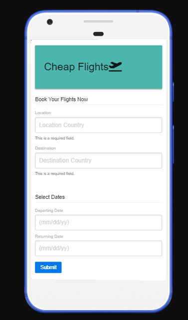

# project1
Name

# "Cheap Flight Finder App"

# Group members:
    -Oluwatoyin Balogun
    -Diego Lehyt

# User History:
    as a frequent traveler, 
    I want to find cheap flights
    I want to search for the cheapest flights to places 
    with the cost converted to the currency of the country 
    I am in currently (my geo-location),
    as a convenient time saver

# Description

"Cheap Flight Finder" is an app that will help you find the cheapest flight tickets which will provide results in the currency of your choice. This app will run in the browser and feature dynamically updated HTML and CSS powered by JavaScript plus the data from the API "open weather". It also feature a clean and polished user interface and is responsive, ensuring that it adapts to multiple screen sizes. like: CellPhones "640px", Tablets "768px", and Laptops "980px".

Name--------------------------------------------------------------

# Instruction 
(Hold "Ctrl" key while you click on image "sample.png" to visualize)

  step 1

  

  - Open URL at the end of this ReadMe file, (recomended Browser: Google Chrome).

  step 2

    Application instructions:
    - Insert the name of the City in the input box.
    - Press on the "search button".
    - All the cities you search will be added to the "cities list".
    - You can reload the page and your "cities list" will be save.

  step 3

  

  - Insert City name and click on "Search Button" to Display 6 days weather info.

  step 4

  

  - Repeat same instructions as "step 3" and the new City will be added to your "Cities List".

  step 5

  

  - Now you can switch between all your cities in your List, just clicking on them to display "weather info".

# App Info Details

  

  - Current day info details.

  

  - 5 Days Forecast info details.

  

# Details

This repository content the html files: index "main page", the CSS styles "style.css", the JavaScript "script.js" and an "image" folder with the captures for this Readme File.

# URL 

The URL to open the page on your Browser is "https://diegolehyt.github.io/homework6/"
