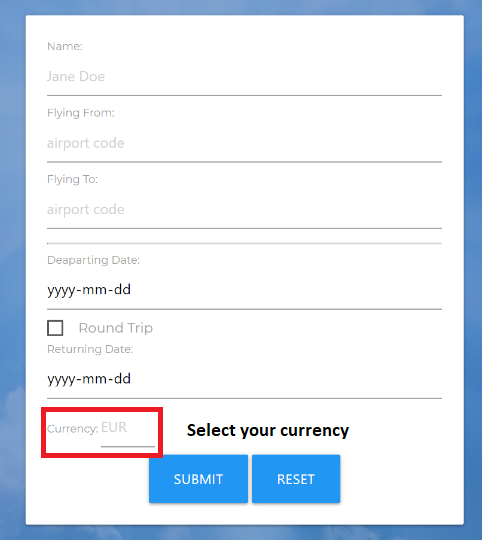

# project1 (Group - 2)

# "Flydable"(Cheap Flight Finder App)

# User Story:
    AS A traveller,
    I WANT to find affordable economy flights
    to and from locations around the world in different currencies,
    So that I can travel more frequently while being economical.

# Instruction 

  step 1

  

  - Open URL at the end of this ReadMe file, (recomended Browser: Google Chrome).

  step 2

    Application instructions:
    - Fill all the requirement fields inside the form.
    - Press on the "submit button", to search for flights.
    - Get the cheapest flights combinations for your destination.
    - You can go back to the main page, and your last current airport code,
    plus your last currency, will be pre-set before your next search.

  step 3

  

  - Fill all the requirement fields inside the form.

  

  - Full Name.  

  

  - City Airport Code "IATA".

  

  - Pick flight schedule from the calendar.

  

  - Check Box able to switch between "one way" and "round trip".

   

  - Choose your currency (3 letters code).

  

  - Click ON "Reset Button" to clear all input boxes plus local storage.

  

  - Click ON "Submit Button" to search for cheapest flight combination.

  step 4

  

  - The app will display one or two "flight Info tickets" depending on your prior choice (one way or round trip).

  

  - Total Price.

  

  - Click ON "Go Back Button" to return to the main page.

# Description

"Flydable" (Cheap EconomyFlight Finder) is an app that will help you find the cheapest flight tickets which will provide results in the currency of your choice. This app will run in the browser and feature dynamically updated HTML and CSS powered by JavaScript plus the data from the APIs "Skypicker" and "Fixer". It also feature a clean and polished user interface and is responsive, ensuring that it adapts to multiple screen sizes. like: CellPhones "640px", Tablets "768px", and Laptops "980px".

# Details

This repository content the html files: index "main page", the CSS styles "style.css", the JavaScript "script.js" and an "image" folder with the captures for this Readme File. 

# Apis

Flights API (Skypicker) and Currency API (Fixer.io);

# Group members:
    - Oluwatoyin Balogun  (github.com/Toyinbalogun)
    - Diego Lehyt (github.com/diegolehyt)

# URL 

The URL to open the page on your Browser is "https://diegolehyt.github.io/project1/"

  

